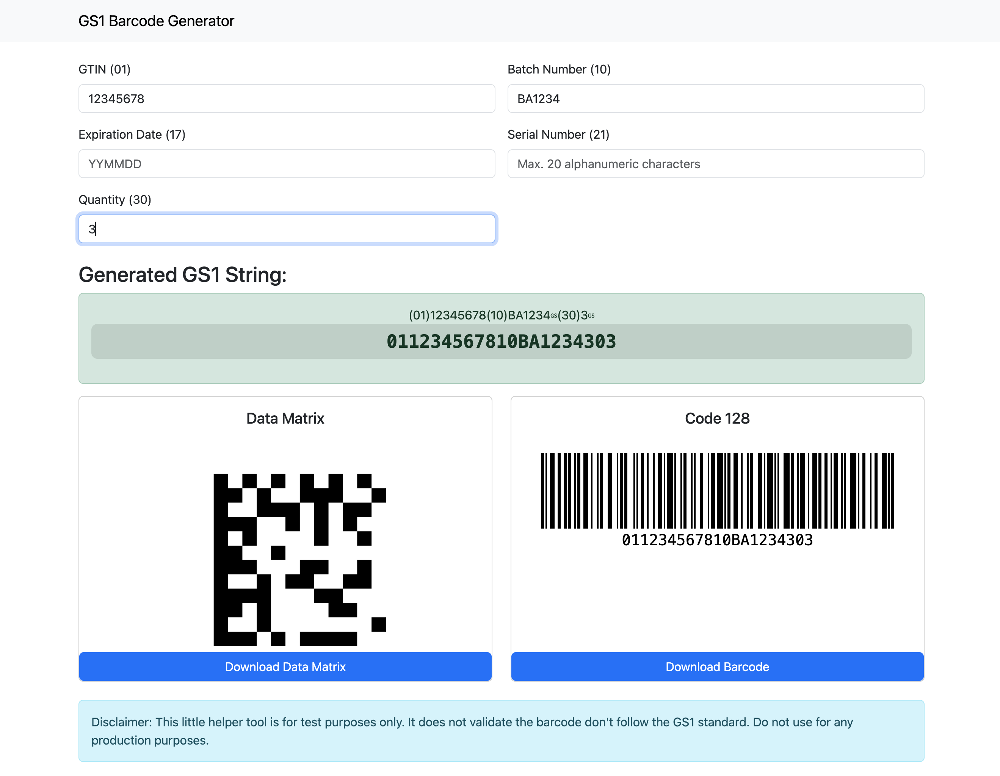

# GS1 Barcode Web Generator

This project is a simple web-based application for generating GS1 barcodes. It allows users to input GTIN, Batch Number, and Expiration Date to generate a GS1 barcode string and visualize it using the JsBarcode library.

## Features

- Input fields for GTIN, Batch Number, and Expiration Date
- Real-time generation of GS1 barcode string
- Visualization of the generated barcode using JsBarcode



## Getting Started

### Prerequisites

To run this project, you need a web browser with internet access.

### Running the Application

1. Clone the repository:
    ```sh
    git clone https://github.com/xremix/GS1-Generator-Web.git
    ```
2. Open `app.html` in your web browser.

Alternatively, you can run the generator directly from the following link:
[Run Generator](https://raw.githack.com/xremix/GS1-Barcode-Generator-Web/main/app.html)

## Usage

1. Open the application in your web browser.
2. Enter the GTIN, Batch Number, and Expiration Date in the respective fields.
3. The GS1 barcode string will be generated and displayed in real-time.
4. The barcode will be visualized below the input fields.

### Prefilling Form Values Using URL Parameters

You can prefill the form values by passing parameters in the URL. Each parameter corresponds to the data-ai attribute of the input fields. The format is ?key=value, where key is the data-ai value and value is the input value you want to prefill

#### Prefill GTIN (01)

`app.html?01=12345678`

*This URL will prefill the GTIN field with the value 12345678.*

#### Prefill Batch Number (10) and Expiration Date (17)

`app.html?01=12345678&10=Batch123&17=230101&21=Serial001&30=100`

This URL will prefill the Batch Number field with Batch123 and the Expiration Date field with 230101.


## Contributing

Contributions are welcome! Please fork the repository and submit a pull request.

## License

This project is licensed under the MIT License. See the [LICENSE](LICENSE) file for details.